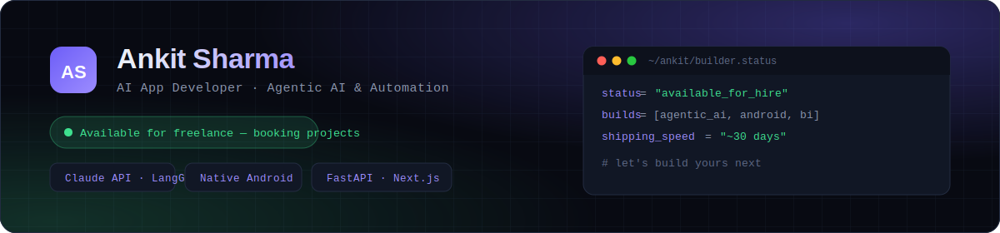

# Ankit Sharma — Portfolio



<div align="center">

[](https://ankitsharma6652.github.io/Ankit-Sharma-Portfolio/)
[](https://www.linkedin.com/in/ankit-sharma-317619177/)
[](https://github.com/ankitsharma6652)

</div>

## 👋 About

Personal portfolio for **Ankit Sharma** — AI App Developer available for freelance work, with a 4+ year data engineering background. Showcases live agentic AI products, native Android apps, and full-stack builds.

**Live site:** [ankitsharma6652.github.io/Ankit-Sharma-Portfolio](https://ankitsharma6652.github.io/Ankit-Sharma-Portfolio/)

---

## 🎯 What's on it

- **Freelance positioning** — services offered (agentic automation, AI SaaS MVPs, BI dashboards, Claude API integration, voice AI, rapid prototypes)
- **Live project showcase** — Quillr (7-agent AI blogging platform), ResearchAI (LangGraph multi-agent research), SpendTracker (native Android expense tracker), plus earlier Gen AI and ML projects
- **Dark / light mode toggle** — defaults to dark for every visitor; if someone switches to light, that choice is remembered via `localStorage` on their next visit
- **Full professional timeline** — Evoke Technologies → Pluralsight India → Tiger Analytics → Infosys
- **Fully responsive** — desktop, tablet, and mobile

---

## 🛠️ Tech Stack

Single self-contained `index.html` — no build step, no framework, no dependencies beyond Google Fonts (CDN).

- **HTML5** — semantic markup
- **CSS3** — custom properties (CSS variables) power the entire theming system, including dark/light mode
- **Vanilla JavaScript** — scroll-reveal animations (Intersection Observer), theme toggle with `localStorage` persistence, mobile nav
- **Fonts:** Space Grotesk, Inter, JetBrains Mono (Google Fonts)

---

## 📂 Project Structure

```
Ankit-Sharma-Portfolio/
├── index.html      # The entire site — HTML, CSS, and JS in one file
├── banner.svg       # Dark-themed banner used at the top of this README
├── resume.pdf       # Downloadable résumé, linked from the Contact section
└── README.md         # This file
```

Everything — styles, fonts, animations, theme logic — lives inside `index.html`. There's no separate stylesheet or script file to keep in sync.

---

## 🎨 Design

Dark-first "builder's console" aesthetic: deep navy background, electric indigo accent, JetBrains Mono for terminal-style UI touches (a mock `~/ankit/builder.status` block in the hero). Light mode uses a matching soft off-white palette with the same accent colors, adjusted for contrast — not a naive color inversion.

---

## 🚀 Featured Projects on the Site

| Project | What it is | Live |
|---|---|---|
| **Quillr** | 7-agent AI blogging platform — research, write, publish | [Demo](https://contentai-utna.onrender.com) |
| **ResearchAI** | LangGraph multi-agent deep research tool | [Demo](https://researchai-3706.onrender.com) |
| **SpendTracker** | Privacy-first Android expense tracker (native Kotlin) | [Demo](https://ankitsharma6652.github.io/SpendTracker/simulation/) |
| **AI MCQ & Meme Generator** | Full-stack Gen AI web app | [Demo](https://quiz-meme.onrender.com/) |
| **MemeMaster** | Meme platform with Google OAuth | [Demo](https://ankitsharma6652.pythonanywhere.com/) |
| **Gabhana Town Website** | SEO-optimized info site | [Live](https://gabhana.vercel.app/) |

Earlier ML/automation projects (Scania Truck Failures, Wafer Fault Detection, JARVIS Assistant, Amazon Price Tracker) are included in a compact "Earlier Work" section further down the page.

---

## 🌐 Running Locally

No build tools needed — it's a static HTML file.

```bash
git clone https://github.com/ankitsharma6652/Ankit-Sharma-Portfolio.git
cd Ankit-Sharma-Portfolio
open index.html          # macOS
# or just double-click index.html in Finder/Explorer
```

## 🚢 Deployment

Deployed via **GitHub Pages** from the `main` branch root. Any push to `main` updates the live site within a minute — no build step, no Actions workflow required.

---

## 📱 Contact

- **Email:** [ankitcoolji@gmail.com](mailto:ankitcoolji@gmail.com)
- **LinkedIn:** [ankit-sharma-317619177](https://www.linkedin.com/in/ankit-sharma-317619177/)
- **GitHub:** [ankitsharma6652](https://github.com/ankitsharma6652)
- **Portfolio:** [Live Site](https://ankitsharma6652.github.io/Ankit-Sharma-Portfolio/)

---

## 📄 License

© 2026 Ankit Sharma. All rights reserved.

---

*Last updated: July 2026*
